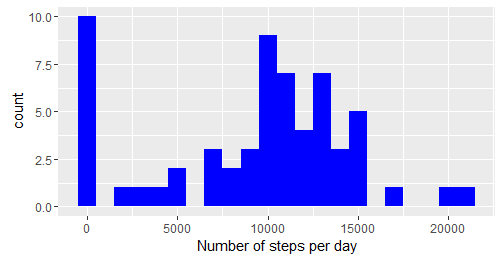
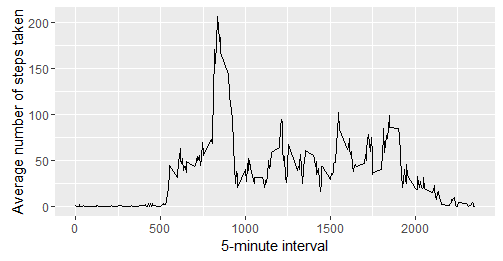
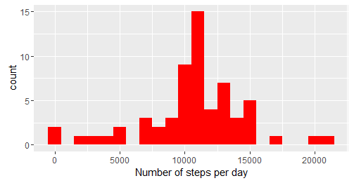
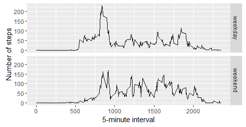

# Reproducible Research: Peer Assessment 1

## Loading and preprocessing the data

```r
unzip(zipfile="data/repdata_data_activity.zip")
data <- read.csv("activity.csv")
```


## What is mean total number of steps taken per day?

```r
library(ggplot2)
dfsteps <- tapply(data$steps, data$date, FUN=sum, na.rm=TRUE)
qplot(dfsteps, binwidth=1000, xlab="Number of steps per day", fill = I("blue"))
```

 

```r
mean(dfsteps, na.rm=TRUE)
```

```
## [1] 9354.23
```

```r
median(dfsteps, na.rm=TRUE)
```

```
## [1] 10395
```


## What is the average daily activity pattern?

```r
library(ggplot2)
averages <- aggregate(x=list(steps=data$steps), by=list(interval=data$interval),
                      FUN=mean, na.rm=TRUE)
ggplot(data=averages, aes(x=interval, y=steps)) + geom_line() +
       xlab("5-minute interval") + ylab("Average number of steps taken")
```

 


On average across all the days in the dataset, the 5-minute interval contains
the maximum number of steps?

```r
averages[which.max(averages$steps), ]
```

```
##     interval steps
## 104      835 230.37
```


## Inputing missing values

There are many days/intervals where there are missing values (coded as `NA`). 


```r
missing <- is.na(data$steps)
table(missing)
```

```
## missing
## FALSE  TRUE 
## 15264  2304
```


All of the missing values are filled in with mean value for that 5-minute
interval.


```r
filldata <- function(steps, interval) {
        filled <- NA
        if (is.na(steps))
            filled <- (averages[averages$interval==interval, "steps"])
        else
            filled <- c(steps)
        return(filled)
}
filleddata <- data
filleddata$steps <- mapply(filldata, filleddata$steps, filleddata$interval)
```

Using the filled data set, let's represent it on a histogram of the total number of steps taken each day and calculate the mean and median total number of steps.


```r
totalsteps <- tapply(filleddata$steps, filleddata$date, FUN=sum)
qplot(totalsteps, binwidth=1000, xlab="Number of steps per day", fill = I("red"))
```

 

```r
mean(totalsteps)
```

```
## [1] 10766.19
```

```r
median(totalsteps)
```

```
## [1] 10766.19
```


We could identify that the mean and median values are higher after replace
the missing data.After replacing missing `steps` values with the mean `steps`
of associated `interval` value, the 0 value used by default on the `NA` was removed 
from the histogram of total number of steps taken each day.

## Are there differences in activity patterns between weekdays and weekends?
First, let's find the day of the week for each measurement in the dataset. In
this part, we use the dataset with the filled-in values.


```r
kindofweekday <- function(date) {
        day <- weekdays(date)
        if (day %in% c("Monday", "Tuesday", "Wednesday", "Thursday", "Friday"))
                return("weekday")
        else if (day %in% c("Saturday", "Sunday"))
                return("weekend")
        else
                stop("invalid date")
}
filleddata$date <- as.Date(filleddata$date)
filleddata$day <- sapply(filleddata$date, FUN=kindofweekday)
```


Create a plot to show the comparison between steps on weekdays and weekends

```r
averages <- aggregate(steps ~ interval + day, data=filleddata, mean)
ggplot(averages, aes(interval, steps)) + geom_line() + facet_grid(day ~ .) +
        xlab("5-minute interval") + ylab("Number of steps")
```

 
